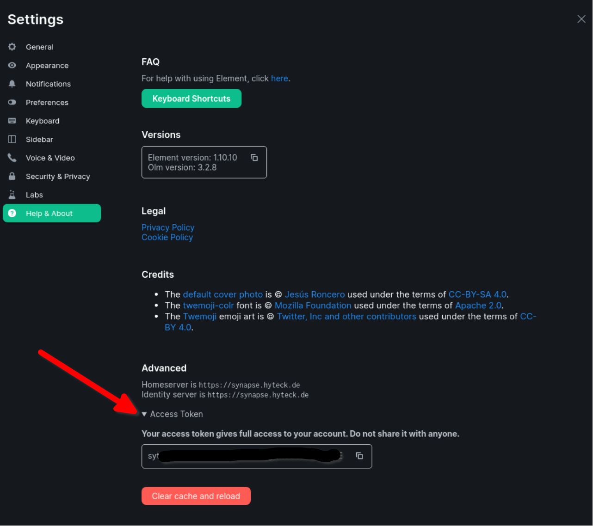

# Setting up maubot (optional)

The playbook can install and configure [maubot](https://github.com/maubot/maubot) for you.

After setting up maubot, you can use the web management interface to make it do things.
The default location of the management interface is `matrix.<your-domain>/_matrix/maubot/`

See the project's [documentation](https://docs.mau.fi/maubot/usage/basic.html) to learn what it
does and why it might be useful to you.

## Adjusting the playbook configuration

Add the following configuration to your `inventory/host_vars/matrix.DOMAIN/vars.yml` file:

```yaml
matrix_bot_maubot_enabled: true
matrix_bot_maubot_admins:
  - yourusername: securepassword
```

You can add multiple admins. The admin accounts are not connected to any matrix ID and are only used to access the
maubot administration interface.


## Installing

After configuring the playbook, run the [installation](installing.md) command again:

```
ansible-playbook -i inventory/hosts setup.yml --tags=setup-all,start
```

## Usage

You can visit `matrix.<your-domain>/_matrix/maubot/` to manage your available plugins, clients and instances.

You should start in the following order
1. **Create one or more clients:** A client is a matrix account which the bot will use to message.
2. **Upload some Plugins:** Plugins can be obtained from [here](https://github.com/maubot/maubot#plugins) or any other source.
3. **Create an instance:** An instance is the actual bot. You have to specify a client which the bot instance will use 
and the plugin (how the bot will behave)

To add a client you first need to create an account and obtain a valid access token.

## Registering the bot user

You **need to register the bot user manually** before setting up the bot. You can use the playbook to [register a new user](registering-users.md):

```
ansible-playbook -i inventory/hosts setup.yml --extra-vars='username=bot.maubot password=PASSWORD_FOR_THE_BOT admin=yes' --tags=register-user
```

Choose a strong password for the bot. You can generate a good password with a command like this: `pwgen -s 64 1`.

## Obtaining an admin access token

This can be done via `mbc auth` (see the [maubot documentation](https://docs.mau.fi/maubot/usage/cli/auth.html)) or  by logging into Element/Schildichat with the bot account
(using the password you set) and navigate to `Settings->Help&About` and scroll to the bottom.
You can expand "Access token" to copy it.



**IMPORTANT**: once you copy the token, just close the Matrix client window/tab. Do not "log out", as that would invalidate the token.
