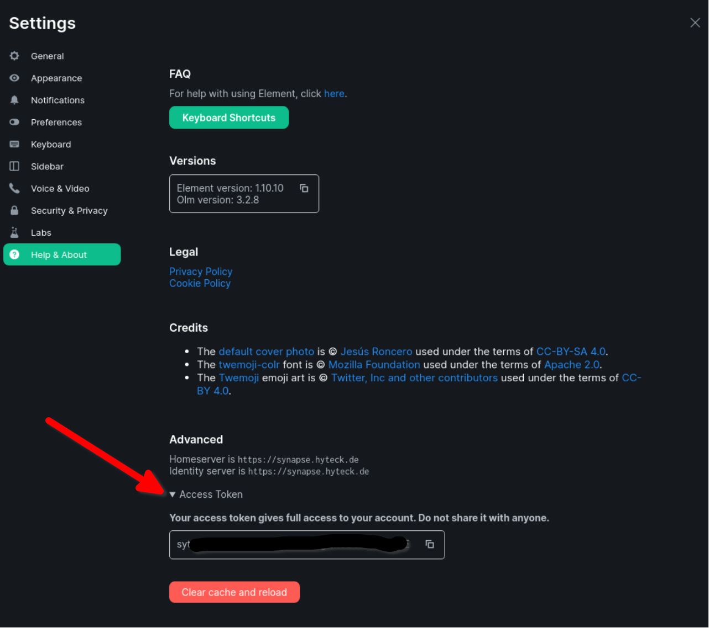

<!--
SPDX-FileCopyrightText: 2022 Dennis Ciba
SPDX-FileCopyrightText: 2022 Slavi Pantaleev
SPDX-FileCopyrightText: 2024 - 2025 Suguru Hirahara
SPDX-FileCopyrightText: 2025 MDAD project contributors

SPDX-License-Identifier: AGPL-3.0-or-later
-->

# Obtaining an Access Token

When setting up some optional features like bots and bridges you will need to provide an access token for some user. This document provides documentation on how to obtain such an access token.

> [!WARNING]
> Access tokens are sensitive information. Do not include them in any bug reports, messages, or logs. Do not share the access token with anyone.

## Prerequisites

The user for whom you want to obtain an access token needs to already exist. You can use this playbook to [register a new user](registering-users.md), if you have not already.

Below, we describe 2 ways to generate an access token for a user — using [Element Web](#obtain-an-access-token-via-element-web) or [curl](#obtain-an-access-token-via-curl). For both ways you need the user's password.

## Obtain an access token via Element Web

1. In a private browsing session (incognito window), open Element Web.
2. Log in with the user's credentials.
3. In the settings page, choose "Help & About", scroll down to the bottom and expand the `Access Token` section (see screenshot below).
4. Copy the access token to your configuration.
5. Close the private browsing session. **Do not log out**. Logging out will invalidate the token, making it not work.



## Obtain an access token via curl

You can use the following command to get an access token for your user directly from the [Matrix Client-Server API](https://www.matrix.org/docs/guides/client-server-api#login):

```sh
curl -XPOST -d '{
    "identifier": { "type": "m.id.user", "user": "alice" },
    "password": "PASSWORD",
    "type": "m.login.password",
    "device_id": "YOURDEVICEID"
}' 'https://matrix.example.com/_matrix/client/r0/login'
```
Change `USERNAME`, `PASSWORD`, and `example.com` accordingly.

`YOURDEVICEID` is optional and can be used to more easily identify the session later. When omitted (mind the commas in the JSON payload if you'll be omitting it), a random device ID will be generated.

Your response will look like this (prettified):

```
{
    "user_id":"@alice:example.com",
    "access_token":">>>YOUR_ACCESS_TOKEN_IS_HERE<<<",
    "home_server":"example.com",
    "device_id":"YOURDEVICEID"
}
```
